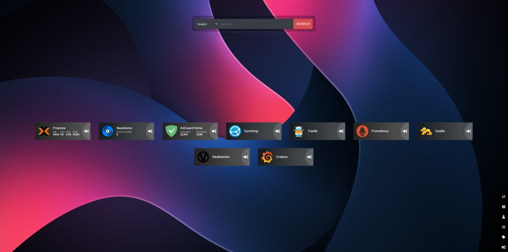
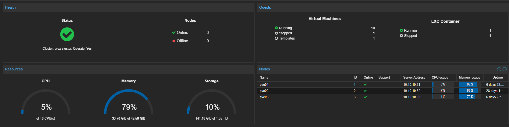
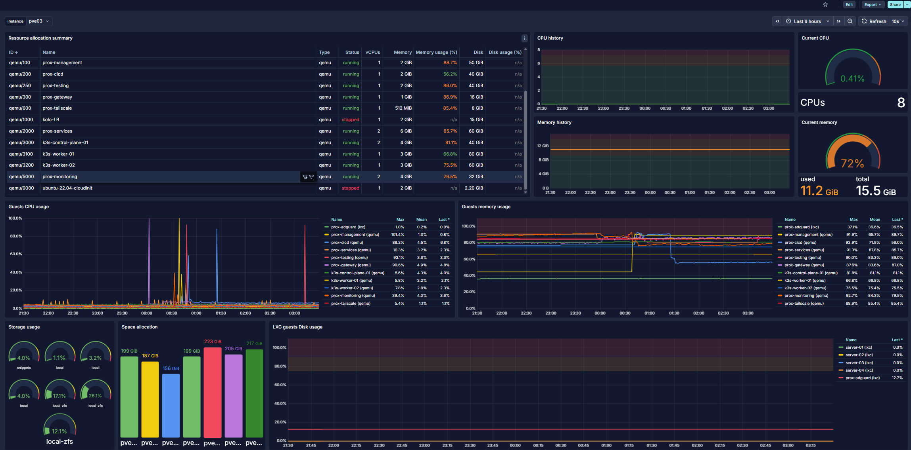

<div align="center">

# homelab-platform

**Personal self-hosted infrastructure — fully automated, monitored and managed as code.**

[](LICENSE)
[](https://www.proxmox.com/)
[](https://docs.docker.com/compose/)
[](https://kubernetes.io/)
[](https://helm.sh/)
[](https://www.ansible.com/)
[](https://www.terraform.io/)
[](https://www.vaultproject.io/)



</div>

---

## About

This homelab was built to learn new technologies and create a personal infrastructure that is independent from external cloud services. The whole environment is described as code (IaC), so it can be rebuilt from scratch at any time.

**Main goals:**

- Learn modern DevOps and Platform Engineering practices
- Infrastructure as code — reproducible, versioned and automated
- Single source of truth for the entire environment

---

## Hardware

| Node   | Model                         | CPU            | RAM   | Storage |
|--------|-------------------------------|----------------|-------|---------|
| pve01  | Lenovo ThinkCentre M910Q Tiny | Intel i5-7500T | 16 GB | 256 GB  |
| pve02  | Lenovo ThinkCentre M910Q Tiny | Intel i5-7500T | 16 GB | 256 GB  |
| pve03  | Lenovo ThinkCentre M910Q Tiny | Intel i7-6700T | 16 GB | 240 GB  |

All three nodes form a **Proxmox VE** cluster, which runs virtual machines that host the individual service stacks.



---

## Architecture

Each service stack runs on a separate **virtual machine** inside the Proxmox cluster. Services are hosted with **Docker Compose** and accessible on the private network. A dedicated VM hosts a **Kubernetes** cluster responsible solely for exposing selected services to the internet — Cloudflared runs inside Kubernetes and routes external traffic through the Cloudflare Tunnel to Traefik, which forwards it to the appropriate service. Metrics and logs are collected centrally by the monitoring stack.

---

## Tech Stack

Infrastructure foundations — the tools that make everything run.

<table>
  <tr>
    <th>Logo</th>
    <th>Name</th>
    <th>Description</th>
  </tr>
  <tr>
    <td></td>
    <td><a href="https://www.proxmox.com/">Proxmox VE</a></td>
    <td>Hypervisor — runs the entire cluster of virtual machines</td>
  </tr>
  <tr>
    <td></td>
    <td><a href="https://www.proxmox.com/en/proxmox-backup-server">Proxmox Backup Server</a></td>
    <td>VM & LXC backups — incremental, deduplicated backups of all virtual machines and containers</td>
  </tr>
  <tr>
    <td></td>
    <td><a href="https://docs.docker.com/compose/">Docker + Docker Compose</a></td>
    <td>Container runtime and service orchestration</td>
  </tr>
  <tr>
    <td></td>
    <td><a href="https://kubernetes.io/">Kubernetes</a></td>
    <td>Container orchestration — runs Cloudflared tunnel and selected services, exposing them externally via Cloudflare</td>
  </tr>
  <tr>
    <td></td>
    <td><a href="https://helm.sh/">Helm</a></td>
    <td>Kubernetes package manager — deploys third-party charts (e.g. Vault Agent Injector) with custom values</td>
  </tr>
  <tr>
    <td></td>
    <td><a href="https://www.ansible.com/">Ansible</a></td>
    <td>Automates VM provisioning and configuration</td>
  </tr>
  <tr>
    <td></td>
    <td><a href="https://traefik.io/">Traefik</a></td>
    <td>Reverse proxy with automatic TLS and Docker integration</td>
  </tr>
  <tr>
    <td></td>
    <td><a href="https://www.cloudflare.com/">Cloudflare + Cloudflared</a></td>
    <td>DNS, tunnel and TLS certificate management</td>
  </tr>
  <tr>
    <td></td>
    <td><a href="https://tailscale.com/">Tailscale</a></td>
    <td>Zero-config VPN for secure remote access</td>
  </tr>
  <tr>
    <td></td>
    <td><a href="https://www.terraform.io/">Terraform</a></td>
    <td>Infrastructure as code — manages Cloudflare DNS/tunnels, Vault policies and RustFS buckets</td>
  </tr>
  <tr>
    <td></td>
    <td><a href="https://www.vaultproject.io/">HashiCorp Vault</a></td>
    <td>Secrets management — AppRole auth for Ansible and Restic, centralized credentials store</td>
  </tr>
</table>

---

## Services

Hosted applications running on top of the infrastructure.

<table>
  <tr>
    <th>Logo</th>
    <th>Name</th>
    <th>Description</th>
  </tr>
  <tr>
    <td></td>
    <td><a href="https://adguard.com/en/adguard-home/overview.html">AdGuard Home</a></td>
    <td>DNS / ad blocking — network-wide privacy filter</td>
  </tr>
  <tr>
    <td>
      
      
      
    </td>
    <td><a href="https://prometheus.io/">Prometheus</a> + <a href="https://grafana.com/oss/loki/">Loki</a> + <a href="https://grafana.com/">Grafana</a></td>
    <td>Monitoring & observability — metrics, logs and dashboards</td>
  </tr>
  <tr>
    <td>
      
    </td>
    <td><a href="https://forgejo.org/">Forgejo</a> + <a href="https://code.forgejo.org/forgejo/runner">Forgejo Runner</a></td>
    <td>Git & CI/CD — self-hosted repositories and pipelines</td>
  </tr>
  <tr>
    <td></td>
    <td><a href="https://www.seafile.com/">Seafile</a></td>
    <td>File storage — self-hosted alternative to Google Drive / Dropbox</td>
  </tr>
  <tr>
    <td></td>
    <td><a href="https://syncthing.net/">Syncthing</a></td>
    <td>File sync — peer-to-peer synchronization between devices</td>
  </tr>
  <tr>
    <td></td>
    <td><a href="https://github.com/dani-garcia/vaultwarden">Vaultwarden</a></td>
    <td>Password manager — self-hosted, Bitwarden compatible</td>
  </tr>
  <tr>
    <td></td>
    <td><a href="https://www.navidrome.org/">Navidrome</a></td>
    <td>Music streaming — self-hosted, Subsonic-compatible</td>
  </tr>
  <tr>
    <td></td>
    <td><a href="https://heimdall.site/">Heimdall</a></td>
    <td>Dashboard — start page with links to all services</td>
  </tr>
  <tr>
    <td></td>
    <td><a href="https://gethomepage.dev/">Homepage</a></td>
    <td>Dashboard — modern, highly customisable start page with Docker and service integrations</td>
  </tr>
  <tr>
    <td></td>
    <td><a href="https://rustfs.com/">RustFS</a></td>
    <td>Object storage — self-hosted S3-compatible store used as Restic backup target</td>
  </tr>
  <tr>
    <td></td>
    <td><a href="https://github.com/bakito/adguardhome-sync">AdGuardHome Sync</a></td>
    <td>DNS sync — keeps two AdGuard Home instances in sync every 5 minutes</td>
  </tr>
</table>



---

## Getting Started

Each stack is started independently with `docker compose up -d` from its directory.

**Prerequisites:**
- Docker + Docker Compose
- A running HashiCorp Vault instance with secrets populated (see `terraform/vault/`)

### Secrets management

All service credentials are stored in **HashiCorp Vault** under `secret/data/services/<service-name>`. Ansible authenticates to Vault via **AppRole** and deploys a `.env` file for each service into `~/.secrets/<service-name>/` on the target host. Docker Compose stacks reference these files via `env_file`.

To deploy secrets to all hosts:

```bash
cd ansible
ansible-playbook -i inventories/services.yml playbooks/deploy-env-files.yml
```

Each host in `inventories/services.yml` declares which services it runs and where the secrets should be written. After this step, all stacks on a given host have their credentials in place and can be started.

### Starting a stack

```bash
# on the target host
cd docker/monitoring
docker compose up -d
```

### Infrastructure provisioning

VM configuration and exporter setup on the hosts is handled by Ansible:

```bash
cd ansible
ansible-playbook -i inventories/hosts.yml playbooks/node-exporter-setup.yml
```

Cloudflare DNS, Vault configuration and RustFS buckets are managed with Terraform:

```bash
cd terraform/cloudflare
terraform init && terraform apply
```

Restic backup agents are deployed and scheduled via Ansible

```bash
cd ansible
ansible-playbook -i inventories/restic-backups.yml playbooks/restic-backup.yml
```

### Kubernetes manifests

Manifests for Cloudflared and services exposed through the tunnel are applied with kubectl:

```bash
kubectl apply -f kubernetes/manifests/cloudflared/
kubectl apply -f kubernetes/manifests/navidrome/
```

Third-party components are installed via Helm charts:

```bash
# Vault Agent Injector
helm repo add hashicorp https://helm.releases.hashicorp.com
helm install vault hashicorp/vault -f kubernetes/releases/vault/values.yaml
```

---

## Documentation

Detailed documentation is in the [`docs/`](docs/) directory.

| Document | Description |
|----------|-------------|
| [Architecture](docs/architecture.md) | Infrastructure topology, host inventory, module dependencies, traffic flow |
| [Getting Started](docs/getting-started.md) | Step-by-step bootstrap guide — from zero to all services running |
| [Secrets Management](docs/secrets.md) | How Vault works, AppRole auth, secret rotation, env file deployment |
| [Variables Reference](docs/variables-reference.md) | All environment variables, Terraform tfvars, and Ansible variables in one place |
| [Ansible](docs/modules/ansible.md) | Playbooks, roles, inventory files, how to run |
| [Terraform](docs/modules/terraform.md) | Three modules, apply order, required variables |
| [Docker Services](docs/modules/docker.md) | All 13 services — hosts, ports, networks, volumes |
| [Kubernetes](docs/modules/kubernetes.md) | Namespaces, manifests, Helm releases, apply order |
| [Scripts & Utilities](docs/modules/scripts.md) | Helper scripts and Ansible templates |

---

## License

[MIT](LICENSE) — feel free to use anything here as inspiration for your own homelab.
